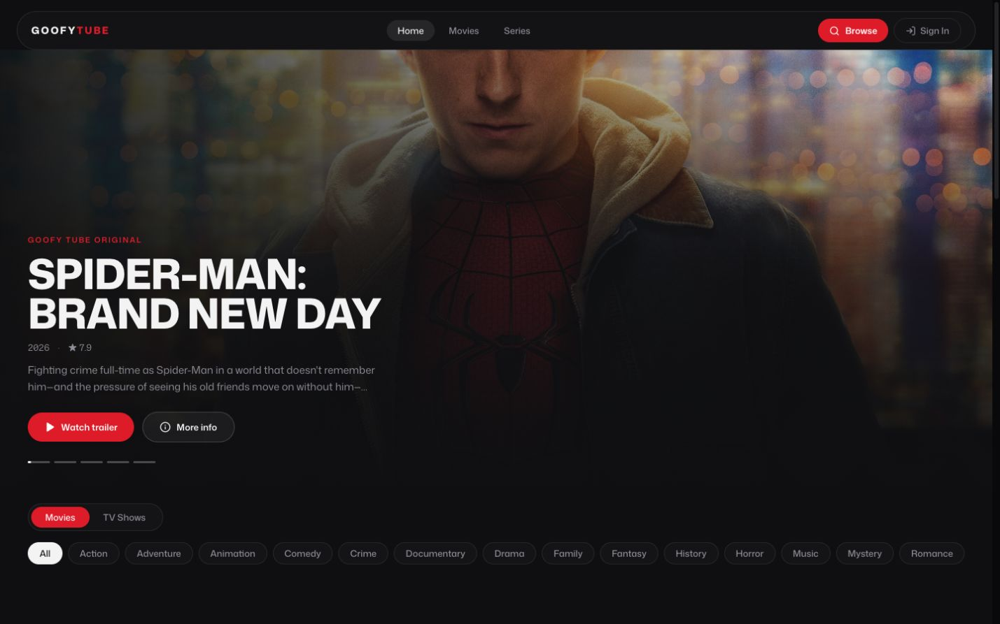
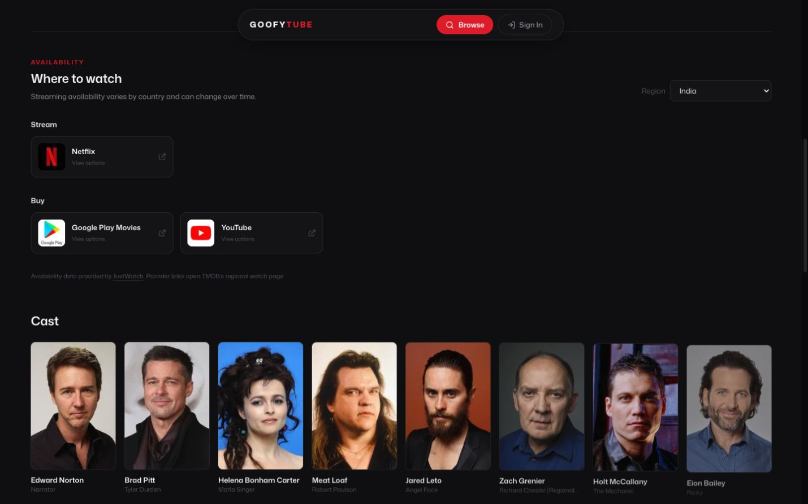
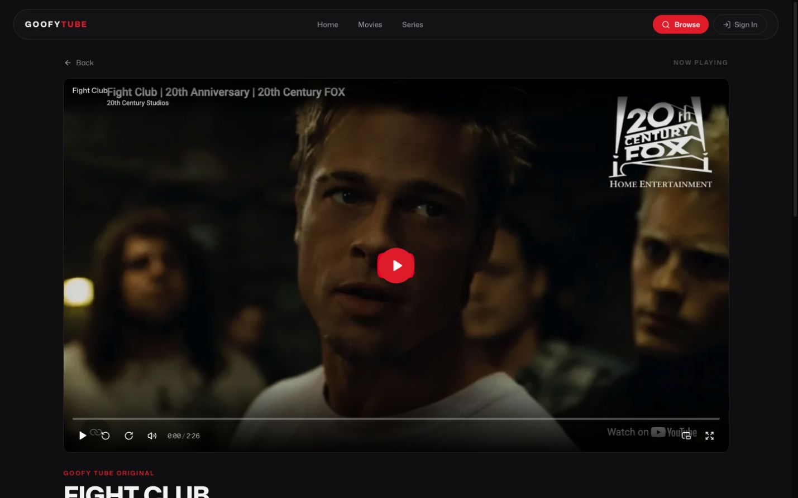
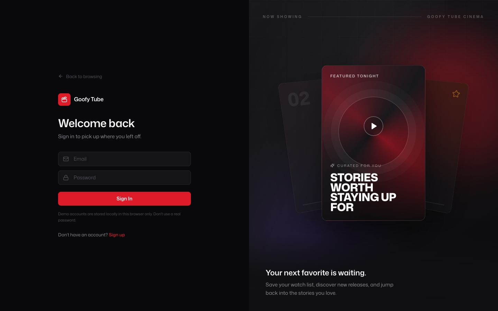

# Goofy Tube

A responsive movie and series discovery experience powered by TMDB and YouTube. Goofy Tube combines cinematic browsing, trailer previews, regional watch availability, custom playback controls, and a per-profile watch list in one dark streaming interface.



## Features

- Cinematic homepage carousel with trailer playback and synchronized progress
- Expandable media cards with hover intent, keyboard support, and trailer previews
- Infinite-scrolling Movies and Series pages with genre and sorting controls
- Search with debounced suggestions and dedicated results pages
- Movie and series details with cast, gallery, recommendations, and trailers
- Regional OTT availability from TMDB and JustWatch, defaulting to India
- Custom Video.js player with seeking, volume, keyboard shortcuts, fullscreen, and PiP
- Native fullscreen where supported and an iPhone-safe full-window fallback
- Native PiP for compatible media, with an in-app floating-player fallback for YouTube
- Local profile authentication and a user-specific watch list
- Responsive layouts, visible focus states, reduced-motion support, and accessible controls

## Screenshots

### Watch availability

Provider availability is grouped by streaming, free, ad-supported, rental, and purchase options. Users can change the country from the region selector.



### Trailer player



### Authentication



## Tech stack

- React 19 and React Router
- Redux Toolkit
- Vite
- Tailwind CSS 4 with shared design tokens
- Video.js with the YouTube tech
- Lucide icons
- TMDB API for metadata, artwork, recommendations, trailers, and watch providers
- JustWatch-powered regional availability through TMDB

## Getting started

1. Clone the repository and enter the project directory.

   ```bash
   git clone https://github.com/your-username/goofy-tube.git
   cd goofy-tube
   ```

2. Install dependencies.

   ```bash
   npm install
   ```

3. Create a `.env` file in the project root and add a TMDB API read token.

   ```bash
   VITE_TMDB_READ_TOKEN=your_tmdb_read_token_here
   ```

4. Start the development server.

   ```bash
   npm run dev
   ```

## Available scripts

```bash
npm run dev      # Start the Vite development server
npm run lint     # Run ESLint
npm run build    # Create a production build
npm run preview  # Preview the production build
```

## Data and playback notes

- OTT availability varies by country and may change over time.
- TMDB watch-provider responses do not include direct per-service deep links. Provider cards open TMDB's regional watch page, which supplies the available destination links.
- Watch-provider data requires JustWatch attribution.
- Trailers are YouTube embeds. Browser autoplay, native fullscreen, and native PiP behavior can vary by device and browser policy.
- Authentication is a frontend demonstration stored in browser `localStorage`; it is not production-grade account security. Do not use real passwords.
